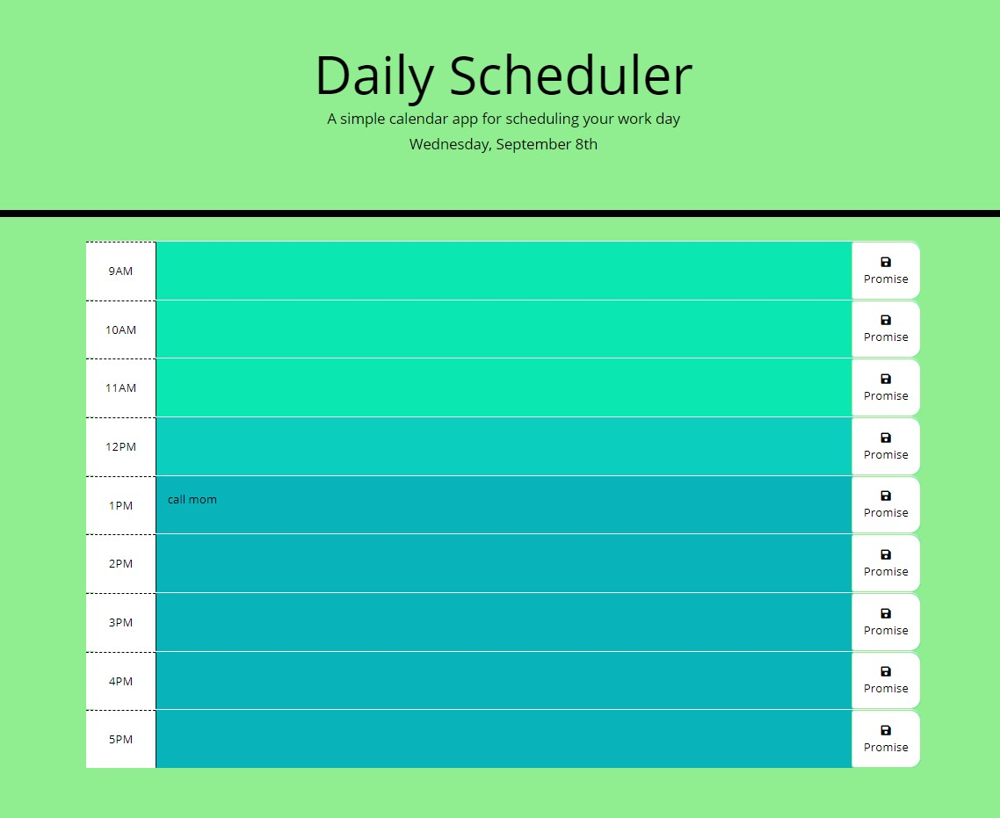

# Third Party APIs : Work Day Scheduler


## Description

This is a simple calendar application that allows a user to save events for each hour of the day by modifying starter code.


## User Story

AS AN employee with a busy schedule
I WANT to add important events to a daily planner
SO THAT I can manage my time effectively


## Table of Contents

* [Usage](#usage)
* [Installation](#installation)
* [Technologies](#technologies)
* [Tests](#tests)
* [Finished Product](#finished-product)
* [Questions](#questions)
* [Learn More](#learn-more)


## Usage

```
GIVEN I am using a daily planner to create a schedule
WHEN I open the planner
THEN the current day is displayed at the top of the calendar
WHEN I scroll down
THEN I am presented with time blocks for standard business hours
WHEN I view the time blocks for that day
THEN each time block is color-coded to indicate whether it is in the past, present, or future
WHEN I click into a time block
THEN I can enter an event
WHEN I click the save button for that time block
THEN the text for that event is saved in local storage
WHEN I refresh the page
THEN the saved events persist

```


## **Installation**

Git : https://git-scm.com/downloads

VS Code : https://code.visualstudio.com/download

Default Browser : As your personal choice


## Technologies

* Git (a command line tool that connects local to github)

* GitHub (a Git repository hosting service that provides a Web-based graphical interface as well as access control and several collaboration features for every project)

* VS Code (Visual Studio Code is a streamlined code editor with support for development operations)

* JavaScript (JavaScript, often abbreviated as JS, is a programming language that conforms to the ECMAScript specification.)

* Bootstrap (Bootstrap is a free and open-source CSS framework directed at responsive, mobile-first front-end web development.)

* jQuery (jQuery is a JavaScript library designed to simplify HTML DOM tree traversal and manipulation, as well as event handling, CSS animation, and Ajax.)


## Testes

Test application by opening ``` index.html ``` with default browser.


## Finished Product

GitHub Page : https://jamly-miller.github.io/Third-Party-APIs-Daily-Scheduler/

ScreenShot :




## Questions

If you have any further questions, please contact me:

GitHub: https://github.com/Jamly-Miller

LinkedIn: https://www.linkedin.com/in/jamly-miller-125307200/


## Learn More

Using CSS Grid & jQuery: Making a Daily Scheduler by Aleks Roslyakov : 
Part 1: https://medium.com/@aleks.roslyakov/using-css-grid-jquery-making-a-daily-scheduler-pt-i-6ba0d2b37e6f
Part 2: https://medium.com/@aleks.roslyakov/using-css-grid-jquery-making-a-daily-scheduler-pt-ii-7af7d239a55d
